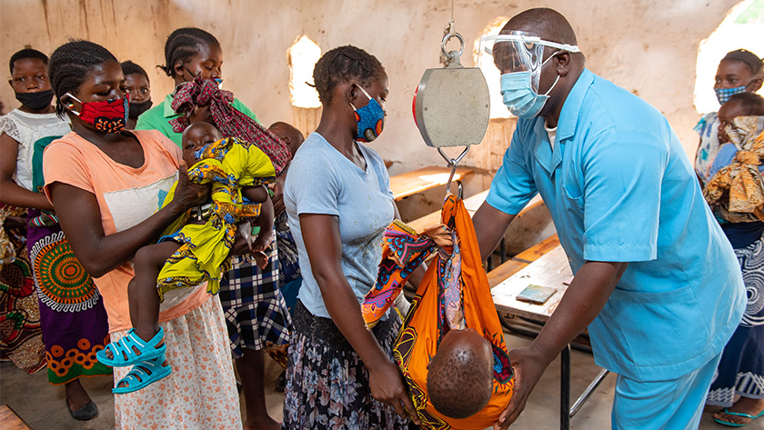

# Health-Care-Data-Anlysis
This is an analysis on public health care and management for the Agege Community, Lagos
# Introduction:

### Microsoft Excel was usesd as a tool in this framework

People in poor countries tend to have less access to health services than those in better-off countries, and within countries, the poor have less access to health services. This article documents disparities in access to health services in low- and middle-income countries (LMICs), using a framework incorporating quality, geographic accessibility, availability, financial accessibility, and acceptability of services. Whereas the poor in LMICs are consistently at a disadvantage in each of the dimensions of access and their determinants, this need not be the case. Many different approaches are shown to improve access to the poor, using targeted or universal approaches, engaging government, nongovernmental, or commercial organizations, and pursuing a wide variety of strategies to finance and organize services. Key ingredients of success include concerted efforts to reach the poor, engaging communities and disadvantaged people, encouraging local adaptation and careful monitoring of effects on the poor. Yet governments in LMICs rarely focus on the poor in their policies or the implementation or monitoring of health service strategies. There are also new innovations in financing, delivery, and regulation of health services that hold promise for improving access to the poor, such as the use of health equity funds, conditional cash transfers, and coproduction and regulation of health services. The challenge remains to find ways to ensure that vulnerable populations have a say in how strategies are developed, implemented, and accounted for in ways that demonstrate improvements in access by the poor.

# Background Of The Study:

Out-of-pocket (OOP) expenditure by households was the most important financing agents through which health expenditure sources channel funds to providers for health services in Nigeria and many other low/middle-income countries.1 The world Health organization (WHO) defined Out-of-pocket payment for health care as, „the direct outlay of households, including gratuities and payments in kind, made to health practitioners and supplies of pharmaceuticals, therapeutic appliances and other goods and services whose primary intent is to contribute to the restoration or to the enhancement of the health status of the individual or population groups. It includes household payments to public services, non-profit institutions and nongovernmental organizations. It also include none reimbursable cost sharing deductions, co-payments and fee-for-service, but excludes payments by the people.
